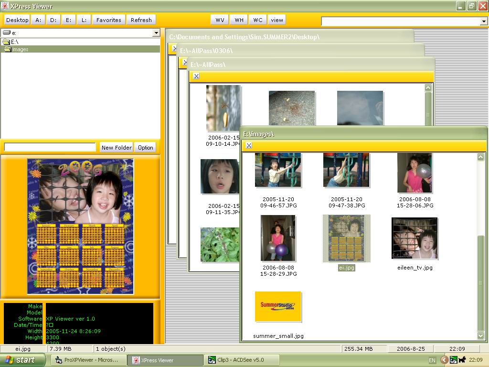

## XPViewer

### Description

Xpress Jpeg Viewer with lots of file management.

i)Fast, adjustable thumbnails viewer (with shadow).

ii)Batch file rename to Exif date.

iii)Smart copy,move to favorite folder.

iv)Fast Picture rotate function.

v)Attach plugin software.

vi)Wallpaper.
 
### More Info
 

             |
---                |---
**Submitted On**   |2006-09-04 19:51:04
**By**             |[Tmax](https://github.com/Planet-Source-Code/PSCIndex/blob/master/ByAuthor/tmax.md)
**Level**          |Advanced
**User Rating**    |5.0 (40 globes from 8 users)
**Compatibility**  |VB 6\.0
**Category**       |[Graphics](https://github.com/Planet-Source-Code/PSCIndex/blob/master/ByCategory/graphics__1-46.md)
**World**          |[Visual Basic](https://github.com/Planet-Source-Code/PSCIndex/blob/master/ByWorld/visual-basic.md)
**Archive File**   |[XPViewer201829962006\.zip](https://github.com/Planet-Source-Code/tmax-xpviewer__1-66454/archive/master.zip)

